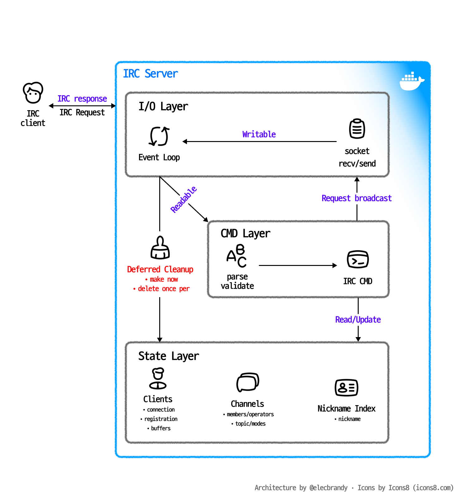

# ft_irc


<br>

## 📌 Overview

> _**Internet Relay Chat**_

- **프로젝트 목표**: C++98 기반 IRC 서버의 구조 개선, 메모리 안정성 확보, 테스트 자동화
- **주요 범위**: `poll()` 기반 이벤트 루프, IRC 명령어 처리, 채널/사용자 상태 관리

<br>
<br>

## 🧩 `ft_irc` 란?

- `ft_irc`는 [IRC(Internet Relay Chat)](https://en.wikipedia.org/wiki/Internet_Relay_Chat) 프로토콜을 직접 구현하는 프로젝트입니다.
- 이 저장소는 소켓 프로그래밍과 네트워크 프로토콜의 기본 구조를 유지하면서, 클라이언트 생명주기와 채널 상태 관리 로직을 더 안전하게 정리하는 것을 목표로 합니다.

<br>
<br>

## 🏗️ System Architecture



`ircserv`는 단일 스레드 이벤트 기반 IRC 서버입니다. 모든 클라이언트 I/O는 하나의 `poll()` 루프에서 처리되고, IRC 명령어는 `Cmd` 계층에서 파싱 및 실행됩니다. 서버 상태는 메모리에만 존재하며, 클라이언트와 채널 정보가 단일 source of truth 역할을 합니다.

| Layer | Responsibility |
|---|---|
| I/O | 클라이언트 접속 수락, non-blocking read/write, send buffer 관리 |
| Protocol | IRC 메시지 파싱, 명령어 dispatch, numeric reply 생성 |
| State | 클라이언트, 채널, 닉네임 인덱스, 채널 모드 관리 |

<br>
<br>

## 📂 Project Structure

```bash
.
├── src/               # 서버 구현 및 IRC 명령어 처리
│   └── Cmd/           # PASS, NICK, USER, JOIN, MODE 등 명령어 구현
├── include/           # 헤더 파일
├── conf/              # MOTD 등 서버 설정 파일
├── docs/              # 아키텍처 및 리팩토링 기록
├── img/               # README 이미지
├── test/              # Python 기반 통합 테스트
├── Makefile
├── Dockerfile
└── docker-compose.yml
```

<br>
<br>

## 🛠️ Tech Stack

| Area | Stack |
|---|---|
| Language | C++98 |
| Network I/O | TCP socket, non-blocking I/O, `poll()` |
| Build | Makefile |
| Test | Python integration test |
| Runtime | Local binary, Docker Compose |
| Debug | AddressSanitizer, UndefinedBehaviorSanitizer, `leaks` |

<br>
<br>

## 🚨 Key Decisions & Troubleshooting

#### 클라이언트 삭제 지연 처리 — 반복자 무효화와 use-after-free 방지

- **문제**
    - `broadcastMsg()`가 `_clients` 또는 channel map을 순회하는 중 `castMsg()`를 호출
    - 죽은 socket으로 전송하다가 `EPIPE`, `ECONNRESET`, `ENOTCONN` 등이 발생하면, 기존 구조에서는 순회 중인 map에서 client를 즉시 erase/delete할 수 있었음
    - 이 경우 반복자 무효화와 use-after-free가 발생할 수 있어 비결정적인 메모리 오류로 이어질 위험이 있었음
- **원인**
    - `QUIT`, ping timeout, write error, `POLLERR/POLLHUP`, broadcast 실패 등 클라이언트 삭제 경로가 여러 곳에 분산됨
    - `markClientForRemoval()`이라는 이름과 달리 실제로는 즉시 teardown까지 수행하던 경로가 있어, 마킹과 삭제의 책임이 섞여 있었음
- **해결**
    - `std::set<int> _toRemove`를 도입해 모든 삭제 경로가 client를 즉시 삭제하지 않고 fd만 표시하도록 변경
    - `markClientForRemoval(fd)`는 마킹 전용, `removeClientFromServer(client)`는 실제 teardown 전용으로 역할 분리
    - 실제 정리는 `cleanupMarkedClients()`에서 poll loop 순회가 끝난 뒤 한 번만 수행
    - channel 퇴장, nickname map 삭제, `_clients` erase, `delete client`, `_fds` 압축을 단일 cleanup 지점으로 통합
    - `acceptClient()`의 `revents = 0` 초기화, `POLLERR/POLLHUP/POLLNVAL` 분기도 함께 추가
- **검증**
    - `make re`, `make test` 통과
    - `make asan` 빌드로 `test/test_lifecycle.py` churn 테스트 실행
    - 다중 클라이언트가 채널에 참여한 뒤 일부가 비정상 종료되고, 남은 클라이언트가 브로드캐스트하는 상황에서 메모리 오류 없이 서버 생존 확인

<br>

#### recv 반환값 타입 수정 — socket error 처리 안정화

- **문제**
    - `recv()`의 반환값을 `size_t`로 받고 있어, 에러 시 반환되는 `-1`이 unsigned 값으로 변환될 수 있었음
    - 이 경우 `recvLen <= 0` 검사를 정상적으로 통과하지 못하고, 잘못된 buffer 접근으로 이어질 위험이 있었음
- **원인**
    - POSIX `recv()`는 `ssize_t`를 반환하지만, 코드에서는 unsigned 타입인 `size_t`로 저장하고 있었음
- **해결**
    - `handleSocketRead()`와 `processClientRead()`의 `recvLen` 타입을 `ssize_t`로 변경
    - `-1`과 `0`을 모두 `recvLen <= 0` 조건에서 정상적으로 처리하도록 수정
- **검증**
    - `make re` 클린 빌드
    - Python 통합 테스트 통과

<br>

#### 채널 운영자 상태 분리 — participant key를 순수 닉네임으로 통일

- **문제**
    - `_participant` map의 key가 일반 사용자는 `nick`, 운영자는 `@nick` 형태로 혼용되고 있었음
    - 참여 여부를 확인하려면 "운영자인지"를 먼저 판단해 key를 재조립해야 했고, 이 패턴이 여러 명령어 파일에 흩어져 있었음
    - `MODE +o/-o`, `NICK`, `KICK`, `PART`, `PRIVMSG` 등에서 참여자 조회와 운영자 상태 갱신이 복잡해짐
- **원인**
    - IRC `NAMES` 응답에 표시되는 `@`는 출력용 표현인데, 이를 내부 상태 key에 저장해 상태와 presentation이 섞였음
    - 운영자 여부의 source of truth가 `_operator`와 `_participant` key 모양 두 곳으로 나뉘는 구조였음
- **해결**
    - `_participant` key는 항상 순수 nickname으로 유지
    - 운영자 여부는 `_operator` map에서만 판단하도록 단일화
    - NAMES 응답을 만들 때만 `isOperator(nickname)` 결과에 따라 `@` prefix를 붙임
    - 운영자 승격/강등 시 participant key를 지웠다가 다시 넣는 로직 제거
    - 더 이상 필요 없어진 `isOperatorNickname()` 선언/정의 제거
- **결과**
    - 참여자 조회가 `find(nick)` 형태로 단순화
    - 운영자 상태 변경 시 `_operator`만 갱신하면 되도록 구조 개선
    - `MODE +o/-o`, `NICK`, `KICK` 이후 참여자 중복/누락 위험 감소
- **검증**
    - `make re`, `make asan`, `make test` 통과
    - `test/test_operator.py`로 첫 참여자 운영자 표시, `+o/-o`, `NICK` 변경 후 `@` 유지, 일반 사용자의 권한 거부, `KICK` 흐름 검증

<br>

#### 등록 클라이언트가 명령 에러로 disconnect되는 문제 수정

- **문제**
    - 등록이 끝난 클라이언트가 알 수 없는 명령을 보내거나 `CmdException`이 발생하면 연결이 끊기는 문제가 있었음
    - 예를 들어 등록된 사용자가 `FOOBAR` 같은 unknown command를 보내면 `421` 응답 후 연결 유지가 아니라 disconnect로 이어질 수 있었음
- **원인**
    - `handleClientCmd()`의 `false` 반환이 "명령 처리 실패"와 "클라이언트를 끊어야 함"을 동시에 의미하고 있었음
    - `processClientRead()`가 `false`를 삭제 필요 신호로 해석하면서, 등록된 클라이언트의 일반적인 명령 에러까지 연결 종료로 처리됨
- **해결**
    - `false`의 의미를 "이 클라이언트는 끊어야 함"으로 한정
    - unknown command는 `ERR_UNKNOWNCOMMAND(421)`를 보내고 연결 유지
    - `CmdException` 발생 시에도 등록된 클라이언트는 에러 reply만 보내고 유지
    - 미등록 상태에서 handshake 관련 에러가 난 경우에만 연결 종료 처리
- **검증**
    - 등록 클라이언트에 `FOOBAR` 전송 시 `421` 응답을 받고 연결이 유지되는지 확인

<br>

#### USER 검증 조건 완화 — churn disconnect 원인 규명

- **문제**
    - 다중 클라이언트 churn 테스트 중 일부 클라이언트가 비결정적으로 끊기는 것처럼 보였음
    - 처음에는 생명주기 race나 지연 삭제 문제로 의심할 수 있는 상황이었음
- **원인**
    - 실제 원인은 race가 아니라 `USER` 명령 검증 조건이 과도하게 엄격했던 것
    - `realname`은 알파벳/공백만 허용하고, `username`은 alnum만 허용해 숫자나 기호가 포함된 표준적인 등록 메시지가 disconnect로 이어졌음
- **해결**
    - `realname`은 제어문자만 거부하도록 완화
    - `username`은 제어문자, 공백, `@`만 거부하도록 완화
- **검증**
    - `test/test_register.py`로 숫자/기호가 포함된 `realname`, `username` 등록 성공 확인
    - 제어문자가 포함된 잘못된 입력은 거부되는지 확인

<br>

#### 테스트 안전망 구축 — 리팩토링 회귀 방지

- **상황**
    - IRC 서버는 실제 socket 연결, 명령어 순서, 서버 응답, 연결 종료 흐름을 함께 검증해야 함
    - 클라이언트 생명주기와 채널 운영자 상태는 수동 테스트만으로 회귀를 잡기 어려웠음
- **결정**
    - `test/run_all.py`를 추가해 `test/test_*.py` 파일을 자동 수집하고 순차 실행
    - `make test`에서 서버 실행 후 Python 통합 테스트를 수행하도록 구성
    - 생명주기 작업 검증을 위해 `make asan` 타깃 추가
- **검증 범위**
    - 등록 흐름과 USER 검증
    - 기본 IRC 명령 처리
    - 운영자 `MODE +o/-o`, `NICK`, `KICK` 흐름
    - 비정상 disconnect 이후 서버 생존 여부
- **결과**
    - 문서 기준 `make test` 4/4 통과
    - ASan/UBSan 빌드로 메모리 오류 여부를 함께 확인할 수 있는 안전망 확보

<br>
<br>

## 🚀 Quick Start

### 1. 환경 설정

`.env` 파일을 생성해 포트와 패스워드를 지정할 수 있습니다. 파일이 없으면 기본값 `6667` / `password`가 사용됩니다.

```dotenv
IRC_PORT=6667
IRC_PASSWORD=password
```

### 2. Docker로 실행

```bash
make up
```

### 3. IRC 클라이언트 접속

```bash
Host     : localhost
Port     : 6667
Password : password
```

`nc`로도 빠르게 연결을 확인할 수 있습니다.

```bash
nc localhost 6667
```

<br>
<br>

## ⚙️ Commands

### Docker

| Command | Description |
|---|---|
| `make up` | 이미지 빌드 후 서버 시작 |
| `make down` | 서버 중지 및 컨테이너 제거 |
| `make restart` | 서버 재빌드 후 재시작 |
| `make log` | 실시간 로그 출력 |
| `make status` | 컨테이너 상태 확인 |
| `make clean-docker` | 컨테이너, 이미지, 볼륨 전체 삭제 |

### Local

| Command | Description |
|---|---|
| `make` | `ircserv` 바이너리 빌드 |
| `make re` | 전체 재빌드 |
| `make clean` | 오브젝트 파일 삭제 |
| `make fclean` | 오브젝트 파일과 바이너리 삭제 |
| `make asan` | AddressSanitizer / UBSan 옵션으로 빌드 |
| `make test` | Python 기반 통합 테스트 실행 |

<br>
<br>

## 💬 Supported IRC Features

| Category | Features |
|---|---|
| Registration | `PASS`, `NICK`, `USER`, registration state 관리 |
| Connection | `PING`, `QUIT`, timeout, partial packet buffering |
| Channel | `JOIN`, `PART`, channel participant/operator 관리 |
| Messaging | `PRIVMSG`, channel broadcast, direct message |
| Operator | `KICK`, `INVITE`, `TOPIC`, `MODE` |
| Channel Mode | `+i`, `+t`, `+k`, `+o`, `+l` |

<br>
<br>

## 👥 Team

| 팀원 | 김동우 | 김세진 | 최란 |
|---|---|---|---|
| 역할 | `Server / Infra` | `CMD / Option` | `Channel / User` |

_*사람이 작성함_
